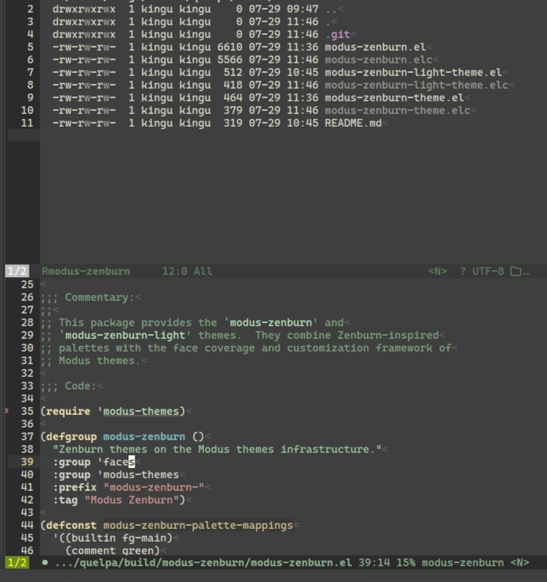
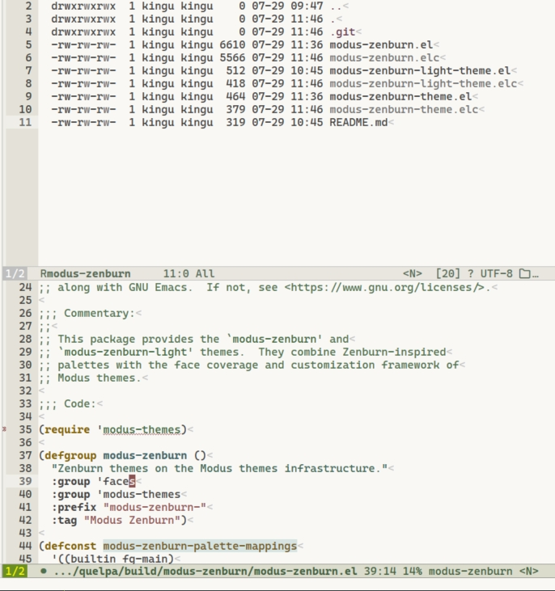

Modus Zenburn
=============

A pair of GNU Emacs themes built on [Modus themes](https://protesilaos.com/emacs/modus-themes/) `5.0.0` or newer: the classic dark Zenburn palette and an original light adaptation.

## Installation

Choose one:

``` elisp
(use-package modus-zenburn
  :vc (:url "https://github.com/kiennq/modus-zenburn" :rev :newest)
  :defer 0
  :custom
  (modus-themes-bold-constructs t)
  :config
  (enable-theme 'modus-zenburn-light)
  (modus-themes-load-theme 'modus-zenburn-light)
  ;; (modus-themes-load-theme 'modus-zenburn)
  )

```

## Screenshots
### Zenburn theme


### Zenburn light theme

